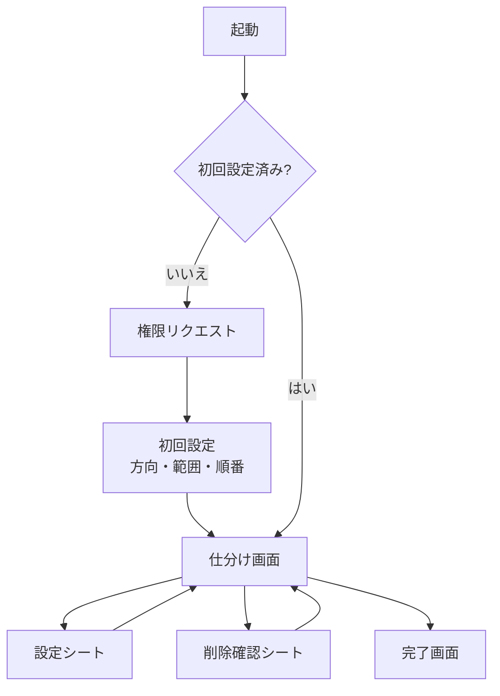

# 写真スワイプ仕分けアプリ 設計書

Sep 25, 2026 · @arii

## 概要

端末内の写真を1枚ずつ表示し、上下左右にスワイプするだけで、その方向に割り当てたアルバムへ仕分けるiOSアプリ。写真の整理を「指を動かすだけ」の作業にするのが狙い。

- **コア体験**：写真が表示される → スワイプする → 対応するアルバムに追加（またはゴミ箱行き）される → 次の写真が表示される、の繰り返し
- **プラットフォーム**：iOS 17以上、SwiftUI
- **対象にするメディア**：静止画とLive Photo（Live Photoは表示と同時に再生する）
- **対象外**：動画

## 決定事項

ヒアリングで確定した仕様と、回答がなかったため仮置きにした前提の一覧。仮置きの項目は後から変更できる。

| 項目 | 決定内容 | 状態 |
| --- | --- | --- |
| 方向の数 | 4方向のみ。各方向の割り当て先として「ゴミ箱」も選べる | 確定 |
| 仕分け済みの判定 | アプリ内に処理済みIDを記録する | 確定 |
| 対象範囲 | 初回起動時に選ぶ（全写真／スクショ除外／期間指定／特定アルバム）。設定画面で変更できる | 確定 |
| 表示順 | 初回起動時に選ぶ（新しい順／古い順／ランダム）。設定画面で変更できる | 確定 |
| スキップ | 画面下部のボタン。スキップした写真は次回起動時に再表示する | 確定 |
| Undo | セッション内なら何回でも戻せる | 確定 |
| Live Photo | 表示と同時に自動再生する | 確定 |
| アルバムの割り当て | 4つ固定（セットの切り替えはなし） | 確定 |
| Live Photoの音声 | ミュートで再生。タップで音声ON | 仮置き |
| ピンチで拡大 | 対応する。拡大中はスワイプでの仕分けを無効にする | 仮置き |
| 画面に出す情報 | 撮影日と残り枚数 | 仮置き |
| iCloudにしかない写真 | ネットワークから取得し、先読みで待ち時間を隠す | 仮置き |
| 一部の写真だけ許可された場合 | 許可された範囲で動かし、全体へのアクセス許可を案内する | 仮置き |
| 対応iOS | iOS 17以上、SwiftUI + SwiftData | 仮置き |
| 配布方法 | 自分用かApp Store公開か | 未定 |

## 機能要件

### F1 初回設定

1. 写真ライブラリへのアクセス許可を求める（読み書き）
2. 4方向それぞれの割り当て先を選ぶ
   - 既存のアルバム、新規アルバム、ゴミ箱の3種類から選ぶ
   - 同じアルバムを複数の方向に割り当てることはできない。ゴミ箱も使えるのは1方向まで
3. 対象範囲を選ぶ（全写真／スクショを除外／期間を指定／特定のアルバム）
4. 表示順を選ぶ（新しい順／古い順／ランダム）
5. 2〜4はすべて設定画面から後で変更できる

### F2 写真の表示

- 対象範囲から、動画と処理済みの写真を除いて、指定の順番で1枚ずつ表示する
- ランダム順の場合は、起動ごとに並びを作り直す
- 撮影日と残り枚数を画面上部に表示する
- 対象の写真がなくなったら完了画面を表示する

### F3 スワイプでの仕分け

- 写真カードをドラッグすると指に追従して動く
- 移動量がいちばん大きい軸を方向として判定し、該当する辺のアルバム名をハイライトする
- 指を離したとき、移動量がしきい値を超えているか、勢いよく弾いていれば仕分けを確定する。どちらでもなければ元の位置に戻す
- 確定したらカードをその方向へ飛ばし、ハプティクスを鳴らす
- アルバム宛の方向：その場でアルバムに追加する。元の写真は「最近の項目」に残る
- ゴミ箱宛の方向：その場では削除せず、削除キューに追加する（F6）

### F4 スキップ

- 画面下部のスキップボタンで次の写真に進む
- スキップした写真は処理済みにしない。そのセッション中は再表示せず、次回起動時にまた表示する

### F5 Undo

- 画面下部のUndoボタンで、直前の操作（仕分け・ゴミ箱・スキップ）を取り消して、その写真を再表示する
- セッション内なら何回でもさかのぼれる
- アルバム追加の取り消し：アルバムから外して処理済みの記録も消す。ただし、追加前からそのアルバムに入っていた写真は外さない
- ゴミ箱の取り消し：削除キューから外す。削除を実行した後の写真は、このアプリからは戻せない（写真アプリの「最近削除した項目」から復元する）

### F6 ゴミ箱（削除）

- iOSは写真を削除するたびに確認ダイアログを出すため、スワイプごとに削除すると作業が止まる。そのため削除はまとめて行う
- ゴミ箱に送った写真は削除キューにため、画面上部に件数バッジを表示する
- 次のタイミングで、キュー内の写真をまとめて削除する（確認ダイアログは1回）
  - バッジから開く削除確認画面で「削除する」を押したとき
  - 完了画面に入ったとき
- 削除した写真は写真アプリの「最近削除した項目」に入り、30日間は復元できる
- 削除待ちのままアプリを終了した場合は、キューを保存しておき、次回起動時に削除するかを確認する

### F7 Live Photo

- カードに表示された瞬間に1回再生し、再生後は静止画（キー写真）に戻る
- ドラッグを始めたら再生を止める
- 音声はミュートで再生する。タップすると音声ありで再生し直す
- Live Photoであることをカードの角にアイコンで示す

### F8 設定画面

- 方向ごとの割り当て、対象範囲、表示順を変更できる
- 処理済みの記録をリセットできる（全写真を最初から表示し直す）
- 写真へのアクセス状態を表示し、iOSの設定アプリに移動できる

## 画面構成と画面遷移

画面は全部7つ。普段使うのは仕分け画面だけで、それ以外はシートか初回のみ表示する。

起動時、前回の削除キューが残っていれば、仕分け画面の上に削除確認シートを出す。

| 画面 | 役割 | 主な要素 |
| --- | --- | --- |
| 権限リクエスト | 写真へのアクセスが必要な理由を説明し、許可を求める | 説明文、許可ボタン、拒否時の設定アプリへの導線 |
| 初回設定 | 方向の割り当て、対象範囲、表示順を順に選ぶ（3ステップ） | 十字型の方向プレビュー、アルバム選択リスト（新規作成・ゴミ箱を含む） |
| 仕分け画面 | メイン画面 | 写真カード、四辺のアルバム名、撮影日、残り枚数、削除キューバッジ、下部にUndo・スキップ・設定ボタン |
| 削除確認シート | ゴミ箱に送った写真を一覧で確認し、まとめて削除する | サムネイルグリッド、個別に戻す操作、「削除する」ボタン |
| 設定シート | F8の内容 | 方向の割り当て、範囲、順番、処理済み記録のリセット、権限状態 |
| 完了画面 | 対象の写真を全部処理したときに表示 | 今回の仕分け枚数（アルバム別）、削除キューの実行、スキップした写真を見直すボタン |

仕分け画面のレイアウトは次のとおり。

- 上端：撮影日、残り枚数、削除キューのバッジ
- 中央：写真カード。四辺にアルバム名を常に表示し、ゴミ箱は赤色とアイコンで区別する
- 下端：Undo、スキップ（中央・大きめ）、設定
- 「下」方向のアルバム名は下端ボタンの上に置き、ボタンと重ならないようにする
